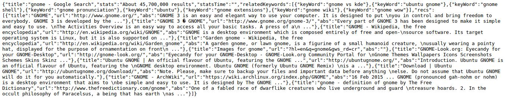

# GoogleService-NodeJs
<center></center>
## what is GoogleService-NodeJs?
GoogleService-NodeJs is an project that enable Google Search Service available to third parties in NodeJs Programming Language.

It works on HTTP Request, all you need to do is provide the url parameters and you will get the search result in Json format from Google Search.
## How to use it?
1, first start the application in a terminal
```bash
node index.js
```
2, second load the main index page, point your browser to following URL
```bash
http://localhost:3000/
```
because I haven't implemented the main index page, so you can implement it yourself and modify the code to display your own index page.

3, third load the result page, point your browser to following URL
```bash
http://localhost:3000/result
```
result page haven't implemented yet!

4, fourth query and get search result by point your browser to following URL
```bash
http://localhost:3000/search?q=gnome
```
<center></center>